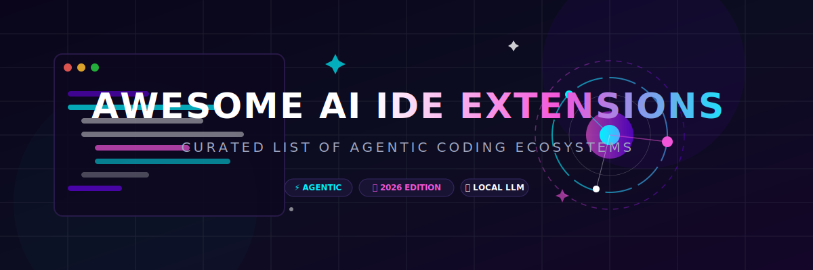

# 🚀 Awesome AI IDE Extensions
### The Ultimate Curated List of AI-Powered IDEs, Agents & Coding Ecosystems 💻🤖

      

**Transforming the way developers write, debug, and deploy code with Agentic AI.**

[SaaS Platforms](#-saas-products) • [Open-Source Projects](#-open-source-github-projects) • [Contributing](#-how-to-contribute) • [Star History](#-star-history)

---

## 📖 Introduction to Agentic Coding & AI IDEs

Welcome to the most comprehensive and up-to-date repository for **AI IDE Extensions** and **Agentic Development Environments**. As of **2026**, the coding landscape has shifted from simple "copilots" to fully autonomous **AI Software Engineers** and deeply integrated **AI-native IDEs**.

This list tracks the best **SaaS platforms** and **Open-Source GitHub projects** that empower developers with:
- 🧠 **Deep Codebase Understanding**: Multi-file indexing and semantic search.
- 🤖 **Agentic Capabilities**: Autonomous task execution and planning.
- 💬 **Natural Language Editing**: Describe changes, and the AI executes them.
- 🛠️ **Local LLM Support**: Privacy-first coding with Ollama, LM Studio, etc.

---

## 🏆 SaaS Products

The AI coding market has matured into a landscape dominated by tech giants and hyper-growth unicorns. Below are the leading SaaS platforms, sorted by their parent company's valuation or latest funding round, separated into IDE/Editor tools, IDE/Editor extensions, and CLI/Terminal tools.

### 🔌 IDE/Editor Extensions

| Tool | Supported IDEs/Editors | Description | Highlights | Pricing | Free Tier Limit | Size (Valuation) |
| :--- | :--- | :--- | :--- | :--- | :--- | :--- |
| **[GitHub Copilot Extension](https://github.com/features/copilot)** | VS Code, JetBrains, Visual Studio, Neovim | AI pair programmer extension for VS Code, JetBrains, Visual Studio, and Neovim. | Code completion, chat, and inline edits. | From $10/mo (Individual), $19/user/mo (Business), $39/user/mo (Enterprise) | 2,000 completions/mo, 50 premium requests/mo (free for verified students/teachers/OSS maintainers) | **$3.5T** (Microsoft) |
| **[Amazon Q Developer Extension](https://aws.amazon.com/q/developer/)** | VS Code, JetBrains, Visual Studio, CMD/Terminal | AWS-native assistant extension for VS Code and JetBrains IDEs. | Code generation, explaining code, security vulnerability scanning. | $19/user/mo (Pro) | 50 chat interactions/mo, 1,000 LOC transformation/mo, 25 account queries/mo | **$2.1T** (Amazon) |
| **[Cody by Sourcegraph](https://sourcegraph.com/cody)** | VS Code, JetBrains, Neovim | AI coding assistant extension using Sourcegraph's code search engine. | Great context retrieval, multi-model selection (Claude, GPT, Gemini). | Pro ($9/mo), Enterprise ($19/user/mo) | 500 autocompletions/mo, 20 chats/mo | **$2.6B** (Sourcegraph) |
| **[Codeium Extension](https://codeium.com/)** | VS Code, JetBrains, Neovim, Xcode, Eclipse, Emacs + 40 others | Free/Pro AI code completion and search extension supporting 40+ IDEs. | Ultra-fast autocomplete, repository-wide context search, and chat. | Individual (Free), Teams ($15/user/mo), Enterprise ($45/user/mo) | Unlimited single-user completions, limited advanced features | **$1.25B** (Codeium / Exafunction) |
| **[Tabnine Extension](https://www.tabnine.com/)** | VS Code, JetBrains, Visual Studio, Eclipse, Sublime Text, Neovim | Context-aware AI code completion and chat extension for multiple IDEs. | Private, secure, and self-hosted/local model support. | Pro ($12/user/mo), Enterprise ($39/user/mo) | Basic completions, 90-day trial for Pro | **$150M** (Tabnine) |
| **[Double.bot](https://www.double.bot/)** | VS Code | AI coding assistant extension for VS Code. | Easy setup, fast completions, access to latest LLMs. | Pro ($20/mo) | 50 premium requests/mo | **$10M** (Seed / YC) |

---

## 📂 Open-Source GitHub Projects

### 🌟 Top Dedicated AI Editors & Agents

- **[OpenCode](https://github.com/anomalyco/opencode)** (Terminal, Neovim, VS Code)  ⌨️  
  Terminal-native coding agent with 75+ provider support and LSP integration.
- **[Cline CLI / Roo Code](https://github.com/cline/cline)** (VS Code)  🤖  
  Model-agnostic autonomous agent for planning, file edits, command execution, and browser use.
- **[Zed](https://github.com/zed-industries/zed)** (Built-in Editor)  ⚡  
  High-performance Rust-based editor with native AI capabilities. Blazing fast.
- **[Aider](https://github.com/Aider-AI/aider)** (Terminal / Git Repo TUI)  ⌨️  
  CLI-based AI pair programmer. Edits files directly in your Git repo. Best-in-class for terminal users.
- **[Continue](https://github.com/continuedev/continue)** (VS Code, JetBrains)  🛠️  
  The leading open-source autopilot. Supports Ollama, local models, and custom workflows in VS Code/JetBrains.
- **[Crush](https://github.com/charmbracelet/crush)** (Terminal TUI)  🍇  
  Charmbracelet's glamorous agentic coding TUI in Go.
- **[Melty](https://github.com/meltylabs/melty)** (Built-in Editor)  🍦  
  First open-source AI editor that tracks changes across your entire stack.
- **[Mentat](https://github.com/AbanteAI/archive-old-cli-mentat)** (Terminal / CLI Editor)  🧠  
  AI coding assistant that lives in your terminal and understands your project context.

### 🔬 Experimental & Specialized OS Tools

- **[Roo Code](https://github.com/RooCodeInc/Roo-Code)** (VS Code)  🦘  
  Advanced agentic coding framework for VS Code.
- **[Tabby](https://github.com/TabbyML/tabby)** (VS Code, JetBrains, Vim/Neovim)  🐱  
  Self-hosted, private AI coding assistant.
- **[Sweep](https://github.com/sweepai/sweep)** (GitHub App integration)  🧹  
  AI-powered GitHub App for automated issue fixing.

---

## 🔍 Why Use AI IDE Extensions? (SEO)

As development complexity grows, **AI IDE Extensions** and **Agentic IDEs** provide a competitive edge. Unlike traditional editors, these tools are "aware" of your entire project structure, documentation, and logic.

### Key Benefits:
- **Reduced Cognitive Load**: Let the AI handle boilerplate and complex refactors.
- **Faster Onboarding**: AI helps explain legacy code and architectural patterns.
- **Autonomous Bug Fixing**: Agents can reproduce bugs and suggest verified fixes.
- **Privacy & Control**: Open-source tools like **Continue** and **Aider** allow for 100% local processing.

---

## 👋 How to Contribute

Contributions make the community awesome! Please follow these steps:

1. **Fork** the repository.
2. **Add/Update** the entry in `README.md`.
3. Ensure the description is **factual** and **concise**.
4. **Submit a PR** with a clear title.

[See full contributing guidelines](CONTRIBUTING.md)

---

## 📈 Star History

---

**[⬆ Back to Top](#-Awesome-AI-IDE-Extensions)**

Made with ❤️ for the AI Developer Community.

<!-- SEO Meta Tags -->
<!-- 
Keywords: AI IDE Extensions, AI IDE, Agentic Coding, Best AI IDE Extensions 2026, Open Source AI Editor, Cursor vs Windsurf, Devin AI, Aider, Continue.dev, Local LLM Coding
Description: A curated list of the best AI-powered code editors, IDEs, and autonomous coding agents for developers. 
-->
